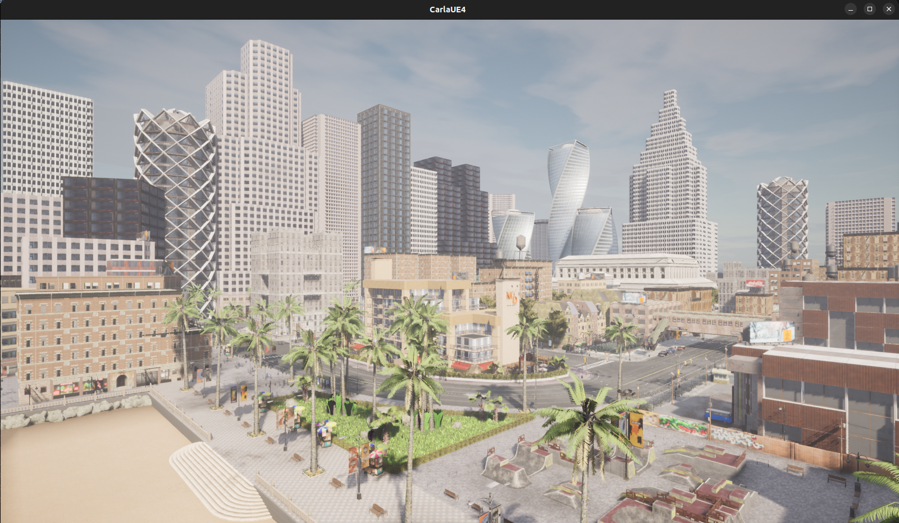

# [快速启动](https://carla.readthedocs.io/en/latest/start_quickstart/) 

本指南演示如何下载并安装 HUTB 的软件包版本。该软件包包含 HUTB 服务器和 HUTB Python 客户端库。

* __[在你开始之前](#before-you-begin)__  
* __[下载 HUTB 打包版](#carla-installation)__
* __[导入额外资产](#import-additional-assets)__  
* __[安装 Python 客户端库](#install-client-library)__
* __[运行 HUTB](#running-carla)__  
    * [启动 HUTB 服务端](#launch-the-carla-server)
    * [运行 Python 客户端示例](#run-a-python-client-example-script) 
    * [命令行选项](#command-line-options)  
* __[更新 HUTB](#updating-carla)__
* __[湖工商内网访问资源](#intranet)__
* __[下一步](#follow-up)__


HUTB 的打包版本可让您快速上手使用 HUTB 模拟器。如果您希望修改 HUTB 的引擎代码或为 HUTB 创建自定义地图或资源，则应按照适合您操作系统的说明 [从源代码构建 HUTB](build_carla.md) 。

---
## 在你开始之前 <span id="before-you-begin"></span>

安装 Carla 之前应满足以下要求：

* __操作系统。__ HUTB 是为 Windows **10** 和 **11**、Ubuntu **22.04** 和 **24.04** 构建的。
* __足够的 GPU。__ 我们建议使用相当于 NVIDIA 2070 或更高版本的专用 GPU，并且至少具有 8Gb 或更大的 VRAM。
* __磁盘空间。__ HUTB 将使用大约 20 GB 的空间。
* __两个 TCP 端口。__ 默认端口为 2000 和 2001。确保这些端口未被防火墙或任何其他应用程序阻止。
* __Python.__ HUTB API 使用 [Python]((https://www.python.org/downloads/)) 进行脚本编写。HUTB 在 Linux 上支持 Python 3.7 至 3.12，在 Windows 上支持 Python 3.7 至 3.12。
* __Pip.__ Python 包管理器版本 20.3 或更高版本。

检查你的 __PIP__ 版本：
```sh
pip3 -V
```

如果你需要升级：
```sh
# 对于 Python 3
pip3 install --upgrade pip
```

---
## Carla 安装 <span id="carla-installation"></span>

### 下载并解压 HUTB 包

使用下方提供的链接从网盘下载所需的 HUTB 软件包。我们建议下载最新版本的软件包，目前版本号为 [2.2](https://pan.baidu.com/s/1YJc4Gnhp20Og7VhKkrkXcQ?pwd=hutb) 。

此网盘可能包含多个版本的 HUTB。您可以选择下载包含所有最新修复和功能的 __当前版本__ 、__之前的版本__ 以及包含所有开发修复和功能的 __夜间版本__ （夜间版本可能不稳定，请谨慎使用）。

该软件包是一个以版本号命名的压缩文件。请下载并解压该压缩包，并将其保存到方便的位置（例如`home`或`Documents`目录）。

---
## <span id="import-additional-assets">导入额外资产</span>

每个版本都有其自己的附加资产和地图包。此附加包包括地图 __Town06__ 、__Town07__ 和 __Town10__ 。它们单独存储以减少构建的大小，因此只能在安装主包后才能导入它们。

__1.__ [下载](download.md) 适合您所需版本的 Carla 的软件包。

__2.__ 解压包：

- __在 Linux 上__:

    - 将包移动到 _Import_ 文件夹并运行以下脚本以提取内容：

```sh
cd path/to/carla/root

./ImportAssets.sh
```

- __在 Windows 上__:

    - 直接将内容提取到根文件夹中。

---

## 安装客户端库 <span id="install-client-library"></span>

使用 PIP 从 [PyPi](https://pypi.org/project/hutb/) 安装 Python 客户端库以获取正式发布的版本：

```shell
pip3 install hutb
```

HUTB 软件包的 Python Wheels 也包含在 `PythonAPI/carla/dist` 中。**如果您使用的是从源代码构建的自定义软件包或 CARLA-latest 软件包，则需要安装软件包中包含的 wheels，而不是 PyPi 中的 wheels**。在此目录中，使用 PIP 安装相关的 wheels：

```sh
cd PythonAPI/carla/dist
pip3 install carla-0.9.15-cp37m-manylinux_2_27_x86_64.whl # 对于使用 Python 3.7 的 CARLA v0.9.15
```

Python 客户端示例脚本依赖于一些先决条件包，请使用 `PythonAPI/examples` 目录中的 PIP 安装这些包：
```sh
cd PythonAPI/examples
pip3 install -r requirements.txt
```

---
## 运行 HUTB <span id="running-carla"></span>

### 启动 HUTB 服务端
使用包顶层的启动脚本启动 HUTB 服务器：


- Ubuntu 包：

```sh
cd path/to/hutb/root

./CarlaUE4.sh
```

- Windows 包：

```sh
cd path/to/carla/root

CarlaUE4.exe
```

将会打开一个窗口，其中包含默认城市地图的视图。这是 HUTB 服务器的 __观察者__ 视图，可用于检查您的模拟情况。要在旁观者视图中飞行，请使用鼠标和 `WASD` 键，按住鼠标右键即可调整视图方向。




### 运行 Python 客户端示例脚本

现在 Python API 客户端库已安装完毕，HUTB 服务器也已运行，它现在正在运行并等待客户端连接并与世界交互。您可以尝试一些示例脚本来在城市中产生生命并驾驶汽车。导航到 `PythonAPI/examples` 目录，打开两个命令行终端，然后运行 `generate_traffic.py` 脚本，再运行 `manual_control.py`。

```sh
# 终端 A 
cd PythonAPI\examples
python3 -m pip install -r requirements.txt
python3 generate_traffic.py  

# 终端 B
cd PythonAPI\examples
python3 manual_control.py 
```

此时将打开一个新的 Pygame 窗口，您可以使用键盘上的箭头键控制 HUTB 模拟器中的车辆。编写 HUTB 脚本时，您需要导入 HUTB Python API，连接到服务器（需要先启动服务器），并使用以下代码访问模拟世界对象 [`world`](python_api.md#carlaworld) ：

```python
import carla

client = carla.Client()
world = client.get_world()
```

还可以在命令行中添加其他参数以用于特殊模式或配置，详情请参阅 [命令行选项文档](ext_quickstart.md#command-line-options) 。此外，还有一个辅助 Python 配置脚本可以启动。

### 命令行选项 <span id="command-line-options"></span>

启动 Carla 时有一些可用的配置选项，可以按如下方式使用它们：

```sh
./CarlaUE4.sh -carla-rpc-port=3000
```

* `-carla-rpc-port=N` 监听端口 `N` 上的客户端连接。流媒体端口默认设置为 `N+1` 。
* `-carla-streaming-port=N` 指定传感器数据流的端口。使用 0 获取随机未使用的端口。第二个端口将自动设置为`N+1`。
* `-quality-level={Low,Epic}` 更改图形质量级别。 在 [渲染选项](adv_rendering_options.md) 中了解更多信息。
* __[虚幻引擎 4 命令行参数列表][ue4clilink]。__ 。虚幻引擎提供了很多选项，但并非所有这些选项在 Carla 中都可用。

[ue4clilink]: https://docs.unrealengine.com/en-US/Programming/Basics/CommandLineArguments

该脚本 [`PythonAPI/util/config.py`][config] 提供了更多配置选项，应在服务器启动时运行：

[config]: https://github.com/carla-simulator/carla/blob/master/PythonAPI/util/config.py

```sh
./config.py --no-rendering      # 禁用渲染
./config.py --map Town05        # 改变地图、
./config.py --weather ClearNoon # 改变天气

./config.py --help # 检查所有可获得的配置选项
```


---

## 更新 HUTB <span id="updating-carla"></span>

无法更新 HUTB 的打包版本。当新版本发布时，存储库会更新，您需要删除以前的版本并安装新版本。

如果您使用 __pip/pip3__ 安装了客户端库，则应通过运行以下命令将其卸载：

```sh
# Python 3
pip3 uninstall carla

# Python 2
pip uninstall carla
```


---

## 湖工商内网访问资源 <span id="intranet"></span>
如果能ping通IP 地址`172.21.108.56`，则可以访问以下资源。

### 人车模拟器的服务器渲染资源
可使用`config.py`来连接远端的代理模拟环境：

```python
python config.py -l --host 172.21.108.56
```
控制台输出所包含的地图信息表示连接成功，然后可以运行其他示例。

### 大模型本地部署
可以通过部署好的 [大模型](software/llm.md) 来辅助开发。

---
## 跟进 <span id="follow-up"></span>

现在您应该已经启动并运行了 HUTB 的打包版本。如果您在安装过程中遇到任何困难，请随时在 [OpenHUTB 论坛](https://github.com/OpenHUTB/hutb/discussions) 或 [Discord](https://discord.gg/8kqACuC) 频道中发帖。

下一步是详细了解 HUTB 的核心概念。阅读 __“第一步”__ 部分开始学习。您还可以在 Python API 参考中找到有关 Python API 类和方法的所有信息。


<div class="build-buttons">
<p>
<a href="../core_concepts" target="_blank" class="btn btn-neutral" title="Go to first steps">
前往：第一步</a>
</p>
</div>
